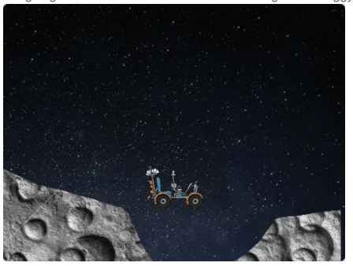

Op 20 juli 1969 zette Neil Armstrong de eerste stap op de maan. Dat is 50 jaar geleden! Deze gedenkwaardige gebeurtenis moeten we vieren! En hoe kan dat nu beter dan door zelf een maanlandings-spel te programeren. Dat gaan we in deze Scratch oefening doen!

Hiervoor heb je nodig:

* Een computer waarop je Scratch 3 kunt draaien (online of offline)

Er is al een begin voor je gemaakt, waarbij je een maanwagen en het maanoppervlakte cadeau krijgt. Deze vind je hier:
[https://scratch.mit.edu/projects/293834812/editor/](https://scratch.mit.edu/projects/293834812/editor/)

Je moet misschien nog inloggen op Scratch om de link te kunnen openen.

Sla het project bij jezelf op als ee Remix en je kunt aan de slag!

