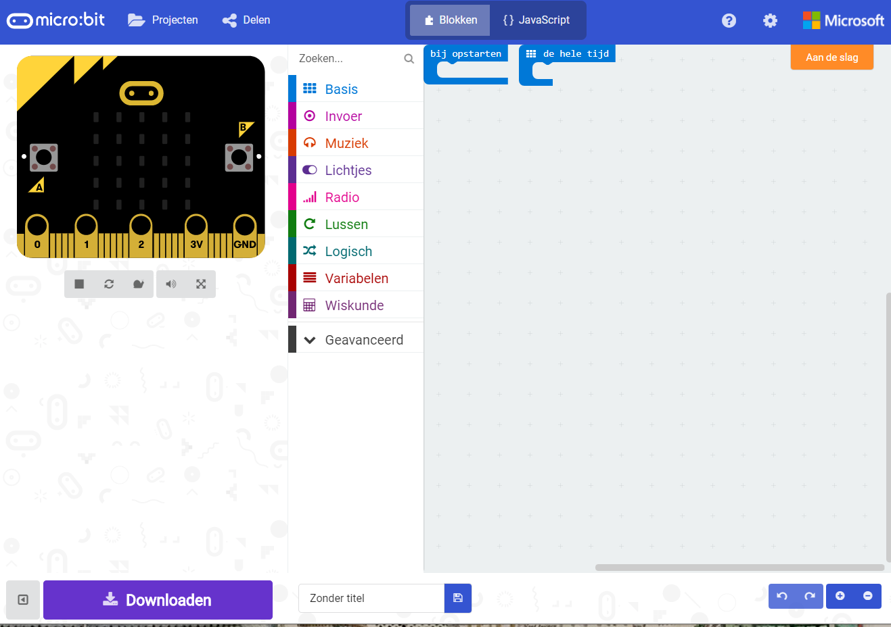

Met behulp van deze Sushi gaan we met de Micro:bit een spelletje programmeren: **Meteors**.

Hiervoor heb je nodig:

* Een BBC Micro:bit
* Een computer met internetverbinding

Om de Micro:bit te kunnen programmeren, ga je naar een online editor:

[https://makecode.microbit.org/](https://makecode.microbit.org/)

Op deze website kun je meteen aan de slag, je hoeft niet in te loggen.

De eerste keer dat je op deze website komt, is hij misschien in het Engels. Dit kun je veranderen in Nederlands. Hiervoor ga je  naar de `Instellingen` \(het tandwiel rechtsboven in het scherm\) en kies je `Language`en kun je vervolgens Nederlands kiezen.

Nu zijn we klaar om te beginnen.

