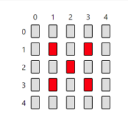
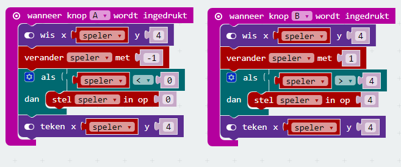
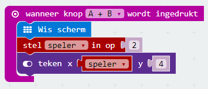

Misschien heb je het wel gemerkt bij het testen: de LED van de speler verdwijnt als je te ver naar links of naar rechts gaat.

De LEDs op de Micro:bit hebben allemaal een eigen waarde. Hieronder zie je hoe dat werkt. Van links naar rechts heb je de x-waarde die loopt van 0 naar 4, van boven naar beneden heb je de y-waarde. Ook die loopt van 0 naar 4.

Je kunt ervoor zorgen dat de speler niet verdwijnt door ervoor te zorgen dat de waarden van de variable `speler`\`niet te groot \(meer dan 4 als je naar rechts gaat\) of te klein wordt \(minder dan 0 als je naar links gaat\).

We willen ook dat als het spel start, de speler in het midden staat. We kunnen ervoor zorgen dat het spel gereset en opnieuw gestart wordt als de knoppen A en B tegelijkertijd worden ingedrukt.

Test of de speler nu niet meer verdwijnt en herstart het spel.

Als je tevreden bent, kun je de code uploaden naar de Micro:bit.

