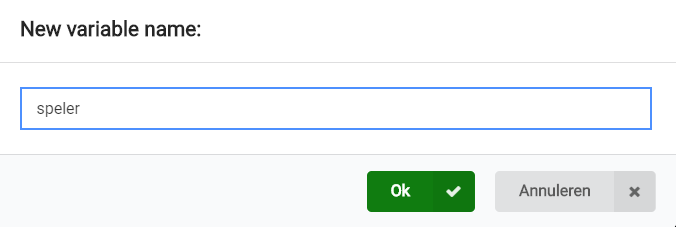
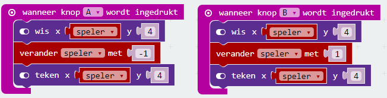
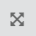
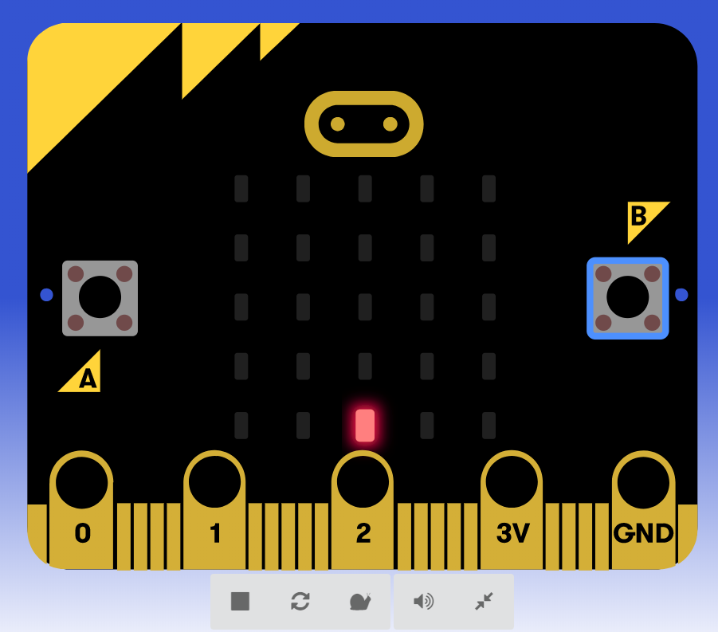

We gaan de knoppen A en B gebruiken om van links naar rechts te bewegen. Om bij te houden waar de gebruiker is, hebben we een variabele nodig. Maak een nieuwe met de naam `speler`.

Met de onderstaande code-blokken kun je de spelersLED naar links en naar rechts bewegen.

Aan de linkerkant van je scherm zie je een afbeelding van de Micro:bit. Je kunt deze vergroten met de knop:  

Klik eens op de knoppen A en B en kijk wat er gebeurt.

Als het werkt zoals je wilt, kun je de code ook uploaden naar de Micro:bit.

