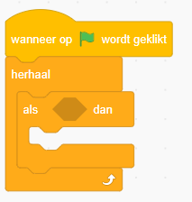
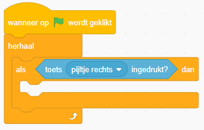
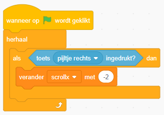
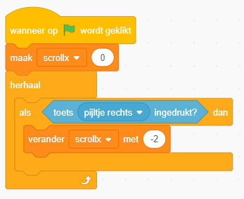

ALs je nu het programma start, gebeurt er helemaal niets. We hebben wel gezegd dat de oppervlakte moet bewegen met variabele `scrollx`, maar nergens wordt `scrollx` veranderd.

Klik op de Buggy sprite \(de maanwagen\) en voeg de volgende code toe:

We voegen aan de herhaal-loop een _als/dan_-loop toe. De code in dit blok wordt alleen afgespeeld als aan de _voorwaarde_ achter `als` wordt voldaan.

Voeg het `toets _ ingedrukt` blok toe als je _als-voorwaarde_. Verander de toets van `spatiebalk` in `pijltje rechts` in het keuzemenu. Dit menu open je door op het pijltje naast naast `spatiebalk` te klikken.

Voeg code toe om `scrollx` met -2 te veranderen, zodat de Surface sprite beweest waneer je `pijltje rechts` indrukt.

Start je programma. Het oppervlakte moet nu naar links bewegen, waardoor het lijkt alsof je maanwagen naar rechts gaat. Wat gebeurt er als je aan het einde van het oppervlakte komt?

Als je dit probeert en het spel opnieuw start, zul je merken dat de oppervlakte nog op dezelfde plaats staat. Als je het spel maar één keer kunt spelen, is er natuurlijk niets aan!

We gaan code toevoegen waarmee je de oppervlakte _reset_ en waar in het midden wordt gezet als je op de `groene vlag` klikt:

---

### **Uitdaging: Maanwagen achteruit laten rijden**

De maanwagen gaat nu alleen vooruit. Kun jij ervoor zorgen dat hij ook achteruit gaat?

