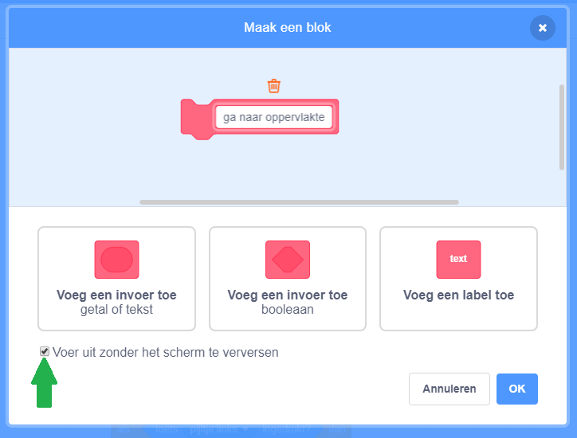
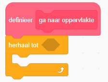
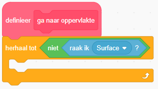
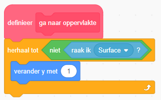
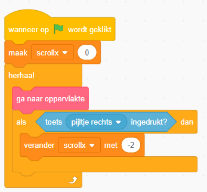
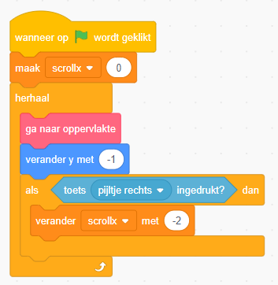

We gaan nu ons eigen blok maken, waarmee we ervoor zorgen dat de maanwagen altijd naar de bovenkant van de oppervlakte (de Surface sprite) gaat. Ga naar `Mijn blokken` en klik `Maak een blok`. Noem je blok `ga naar oppervlakte` en zet een vinkje voor `voer uit zonder het scherm te verversen`.

Als we normaalgesproken een loop maken, wordt deze loop één keer afgespeeld in elk frame van het spel. Door `voer uit zonder het scherm te verversen` aan te klikken wordt het hele blok afgespeeld, zonder dat je hoeft te wachten op het volgene frame.

Als je op `OK` drukt, krijg het het blok `definieer ga naar oppervlakte` te zien. Voeg een *herhaal-tot`-blok toe:

We willen de code in dit blok herhalen totdat de sprite Surface de maanwagen niet meer aanraakt:

Elke keer als we door de herhaal-loop gaan, willen we dat de maanwagen een pixel omhoog gaat:

Dit 'duwt' de maanwagen naar boven als hij de Surface sprite aanraakt. Net zo lang totdat hij deze sprite niet meer aanraakt.

We zijn nu klaar met het schrijven van de code voor ons `ga naar de oppervlakte` blok, maar we gebruiken hem nog niet. We moeten hem nog toevoegen aan onze basis-code:

Start nu het programma. Je maanwagen gaat nu omhoog als hij de heuvel oprijdt. Maar hij landt niet als je de heuvel afrijdt.

Om de maanwagen de heuvel af te laten rijden, gaan we zwaartekracht toevoegen. Voeg een `verander y` blok toe om de maanwagen langzaam te laten vallen als hij in de lucht hangt:

