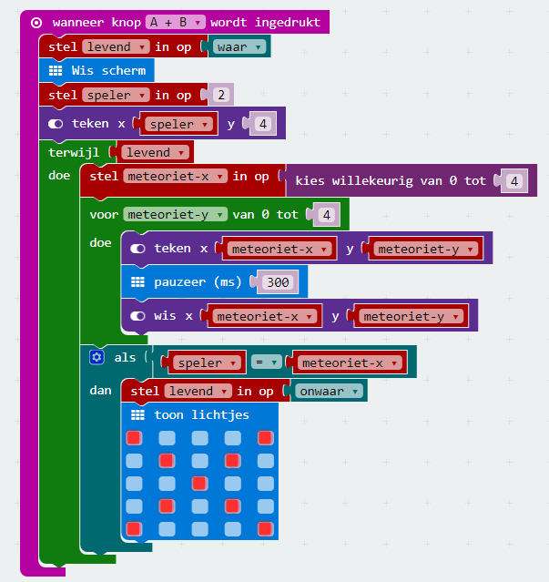
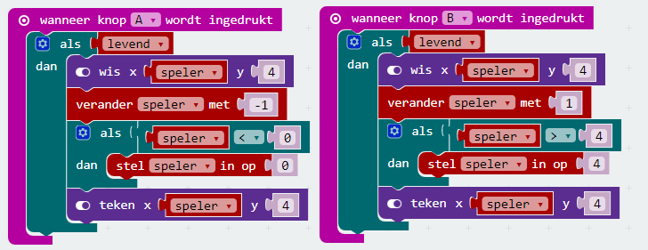

We zijn nu bijna klaar! We willen er nu voor zorgen dat de speler door kan spelen, totdat hij door een meteoriet wordt geraakt. Dat kunnen we door gebruik te maken van een variabele `levend`te gebruiken en een `while`loop toe te voegen.

En nu gaan we er tenslotte voor zorgen dat de speler niet meer kan bewegen als het GAME OVER is.

