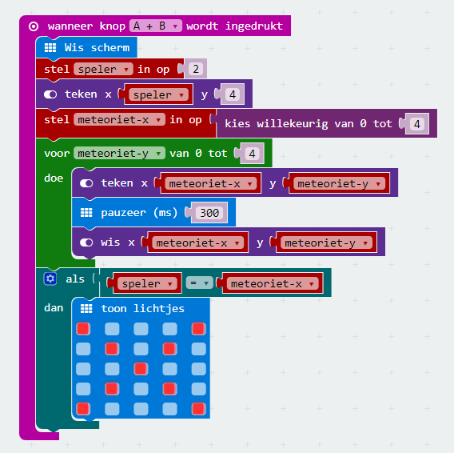

Als de meteoriet de bodem bereikt, moeten we kijken of de meteoriet de speler geraakt heeft. Dit gaan we doen door de variabelen meteoriet-x en speler met elkaar te vergelijken. Als die aan elkaar gelijk zijn, dan is de speler geraakt.

