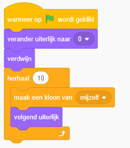

Nu kunnen we nog niet erg ver over de maan reizen voordat we ervan afvallen! Laten we een groter gedeelte van de maan gaan onderzoeken!

Klik op de Surface sprite en splits `wanneer op de groen vlag wordt geklikt` van de rest van de code:

Voeg onder `wanneer op de groene vlag wordt geklikt` code toe om de beginstatus in te stellen:

Voeg een herhaling toen die een kloon van elke uiterlijk van de sprite maakt:

Voeg aan de code die je gesplitst hebt het `wanneer ik als kloon start`-startblok toe:

Omdat het oppervlakte van de maan uit meerdere uiterlijken bestaat, moeten we die over het scherm verplaatsen met onze `scrollx` variabele. Maar elk uiterlijk met een verschuiving hebben van 480 pixels ten opzichte van het vorige uiterlijk (de breedte van een uiterlijk is 480 pixels):

Als er ons spel nu starten, zien we de maanopperkte sprites niet. Dit komt omdat we eerder tegen Scratch hebben gezegd ze te laten verdwijnen. We willen ook niet zomaar alle sprites laten zien, want Scratch laat onze sprites niet helemaal uit het scherm lopen als we bewegen. In plaats daarvan kunnen we Scratch vertellen dat als het huidige x-coördinaat van de sprite is waar we denken dat het moet zijn, de sprite moet verschijnen. Anders moet hij verdwijnen. In code ziet dat er zo uit:

**Tip:** Als je geen code opnieuw wilt maken voor de positie van de oppervlakte, kun je een kopie maken door mt rechts op het `+`-blok te klikken en `Kopie maken` te kiezen:

Als je nu je programma start, zal je eerste oppervlakte sprite aan de rechterkant buiten het scherm verschijnen. Dit kun je repareren door op de maanwagen (Buggy) sprite te klikken en de waarde van `scrollx` in `-480` te veranderen:

