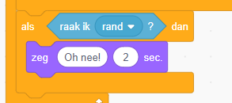
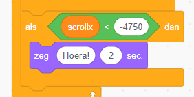

Als je wat verder over de maan rijdt, zul je een aantal afgronden tegenkomen. We willen natuurlijk niet in de bodemloze put vallen! Laten we code toevoegen zodat we er overheen zullen springen en daarna bij de finish zullen komen.

We beginnen met te vertellen dat we verloren hebben als we in een afgrond vallen. Hiervoor kunnen we gebruik maken van het `raak ik rand>`-blok. Hiermee controleren we of we de rand van het scherm raken. Als dat zo is, zijn we af. Aan het einde van de *herhaal-loop* van de maanwagen (Buggy) voegen we de volgende code toe:

Start het spel. Als je nu een afgerond inrijdt, is het spel afgelopen.

Nu we het spel kunnen verliezen, moeten we natuurlijk ook kunnen winnen. Dit gebeurt als we het einde halen. Voeg de volgende code toe aan het einde van de *herhaal-loop* van de maanwagen (Buggy):

Merk op dat we een `<`-blok moeten gebruiken omdat we een negatieve waarde voor `scrollx` ingevuld.