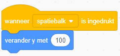
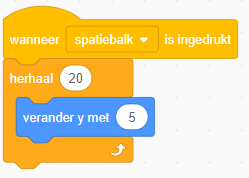

We willen de maanwagen laten springen om obstakels te ontwijken!

Voeg de volgnde code toe om de maanwagen 100 pixels te laten springen als de spatiebalk wordt ingedrukt:

Start je programma. Je kunt de maanwagen laten springen, maar het ziet er niet erg soepel uit.

Verander de code als volgt aan om de sprong er wat soepelere uit te laten zien:

