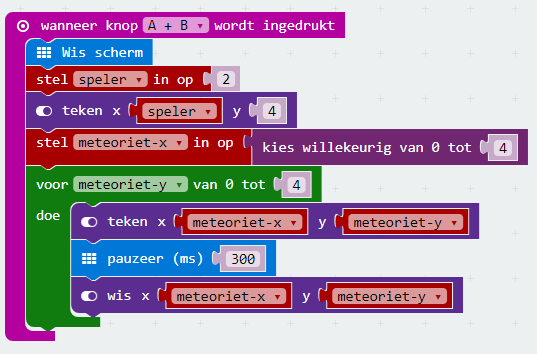

Nu de speler werkt en bestuurd kan worden, wordt het tijd dat er meteorieten gaan vallen.

Die beginnen op een willekeurige positie op de bovenste rij van het raster en vallen langzaam naar beneden. We hebben dus twee variabelen nodig om hun positie bij te houden: meteoriet-x en meteoriet-y. 

`meteoriet-x` moet worden ingesteld op een willekeurig \(random\) waarde tussen 0 en 4. `meteoriet-y` wordt bijgehouden met een `for` loop die van 0 naar 4 loopt.

Voeg de volgende code toe aan het event dat hoort bij het indrukken van de knoppen A+B tegelijkertijd.

